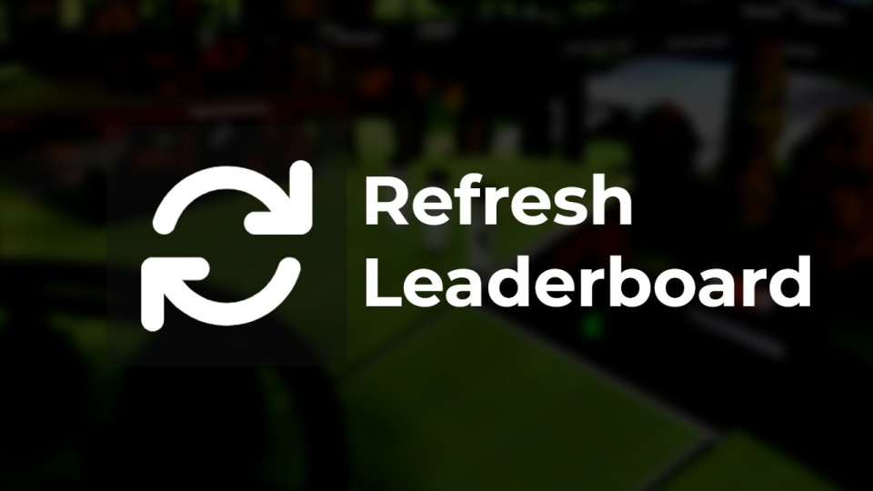

# Refresh Leaderboard

This Openplanet plugin does the trick of turning "Always display records" off and on again to refresh the leaderboards at the click of a button, saving you a few clicks to the settings. It is also styled to fit in with the default UI, hides in gamemodes where the leaderboards aren't visible, and hides when the leaderboard has been collapsed. The button position and size are customisable, or you can let the plugin position and size it to fit with the default UI.

## Project Contributors

- Creator
    - Nils Beerten (nbeerten)
- Current Maintainer
    - Ezio Mariani (Ezio416)
- Others
    - Max Kaye (XertroV)
    - Daniel Peukert (dpeukert)
    - titisee5
    - W1lla van den Munckhof

